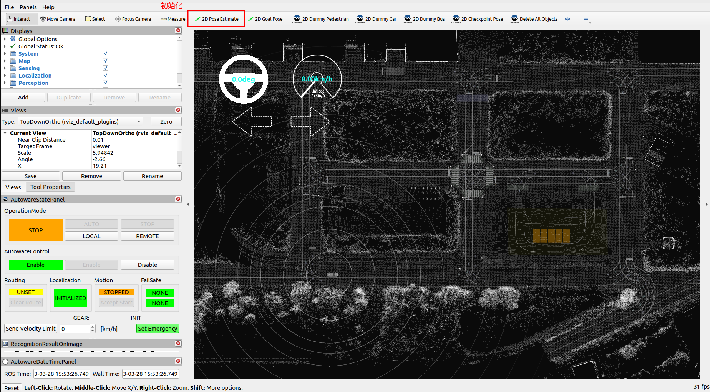
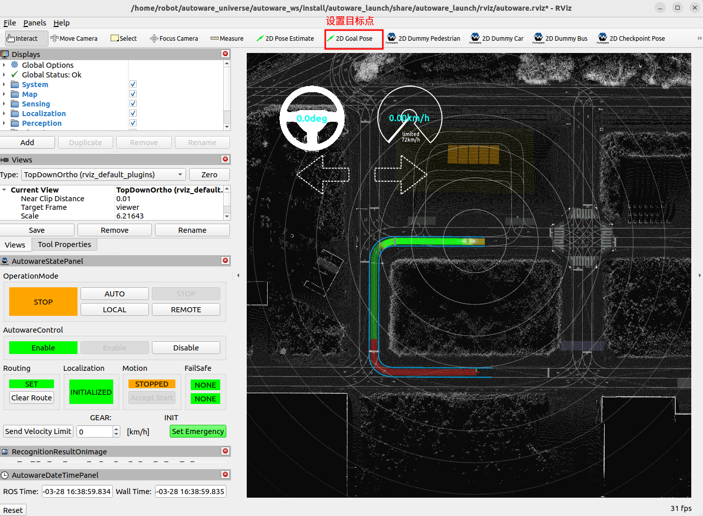
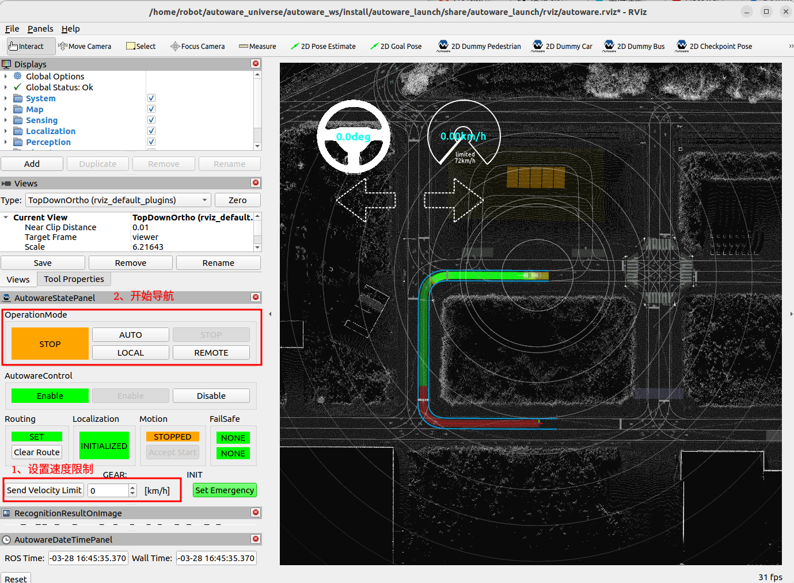
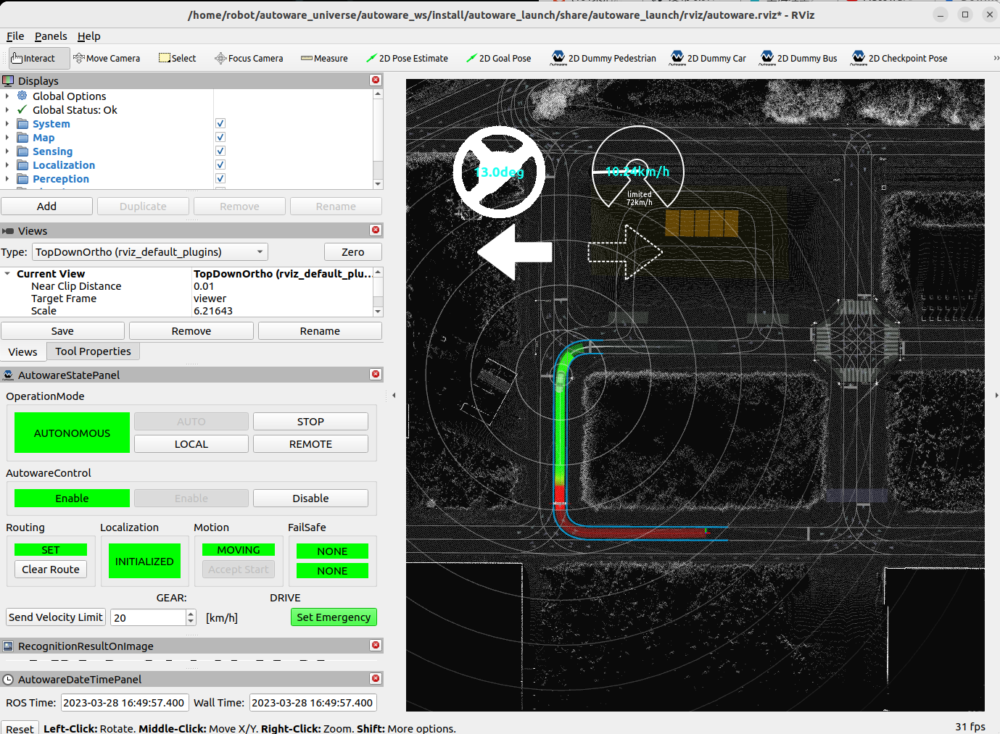
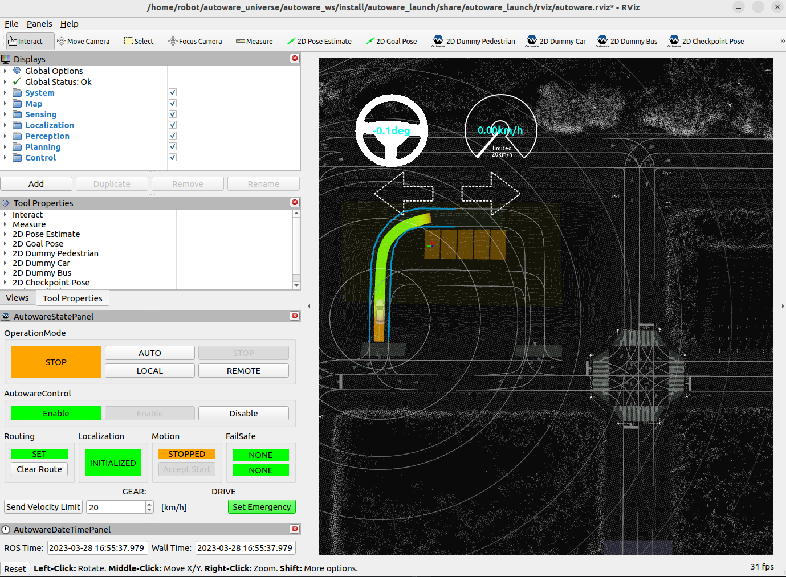
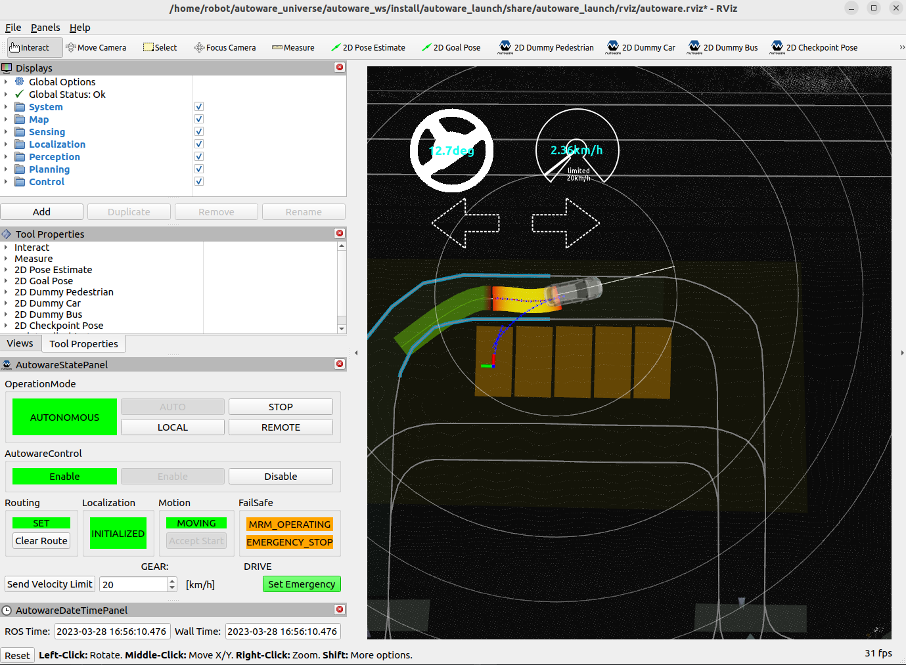
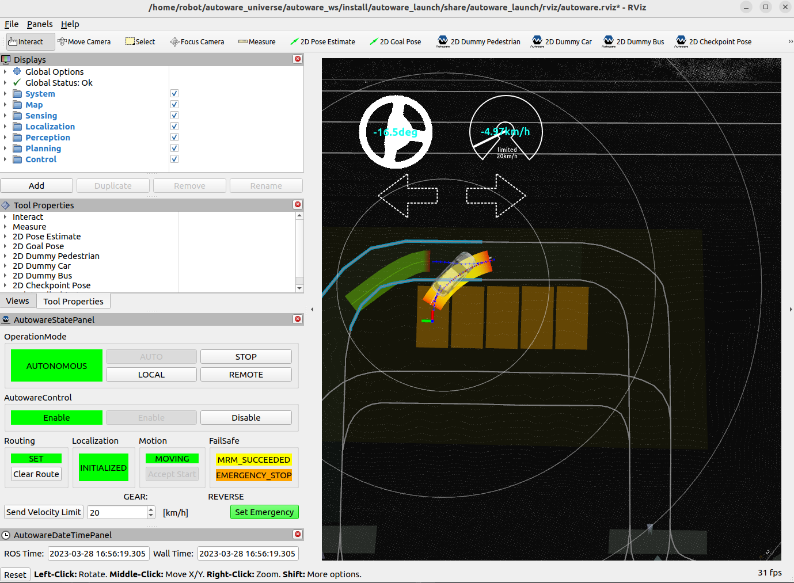

### Planning simulation

官方提供的一个演示程序，参考链接 ：

```http
https://autowarefoundation.github.io/autoware-documentation/main/tutorials/ad-hoc-simulation/planning-simulation/
```

### 一、准备

- 下载高精度地图 

```sh
# 终端下载不了也可以直接打开链接网页下载
gdown -O ~/autoware_universe/autoware_map/ 'https://docs.google.com/uc?export=download&id=1499_nsbUbIeturZaDj7jhUownh5fvXHd'
unzip -d  ~/autoware_universe/autoware_map/ ~/autoware_universe/autoware_map/sample-map-planning.zip
```

### 二、运行

- 启动launch文件

```sh
source ~/autoware_universe/autoware_ws/install/setup.bash

ros2 launch autoware_launch planning_simulator.launch.xml map_path:=$HOME/autoware_universe/autoware_map/sample-map-planning vehicle_model:=sample_vehicle sensor_model:=sample_sensor_kit
```

- 初始化车辆位置

在程序运行后会打开rviz，点击  2D Pose estimate 按键对位置进行初始化，注意位置初始化时一定要符合道路线条，总不能让车逆行吧 ...



- 设置目标点

rviz2 中点击 2D Goal Pose 设置目标点，然后 autoware 会自动规划出路径用于导航 ：



- 设置速度 & 启动

rviz2 左下角部分 Send Velocity Limit 设置最大速度，这里默认是0，如果是0将不能进行下一步自动导航，设置为10 km/h ，然后点击  **Send Velocity Limit** ；上面的 OperationMode处 AUTO按键亮起后点击即可开始运动 ：






### 三、自动泊车

例子中还能实现自动泊车，以及红绿灯检测等其他功能，详情看官方链接 ：






