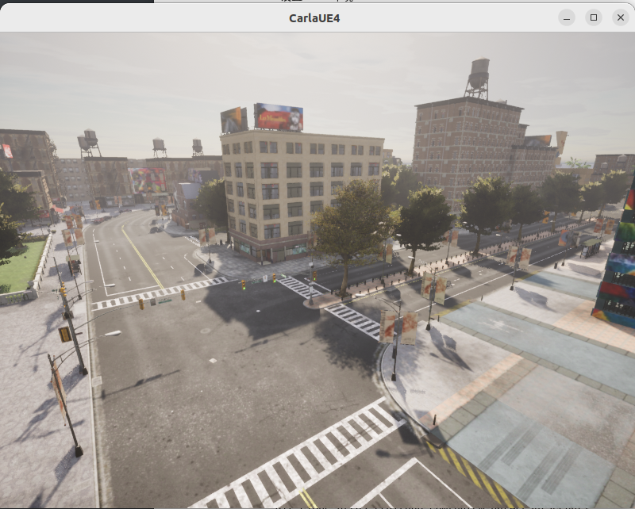

### Carla

（缺点是配置起来实在太麻烦了，甚至没有SVL方便好用

！！！而且我用一次晕一次，想吐，用不起用不起）

Carla是一个开源自动驾驶的仿真器，也有相应的论文，下面是github官网的链接 : 

```http
https://github.com/carla-simulator/carla
```

### 下载

选择右边Releases 最新的版本，当前最新的版本是 0.9.14 ，然后选择对应的系统版本，主要是在ubuntu系统中进行仿真学习 （总共6G左右，挺大的） ：

```http
https://github.com/carla-simulator/carla/releases/tag/0.9.14
```

### 安装

直接解压到  ~/autoware_universe/CARLA_0.9.14 路径中，不需要单独编译，但是这里直接启动会报错 ：libomp.so.5: cannot open shared object file: No such file or directory ，解决方法是重新安装 ：

```sh
sudo apt-get install libomp5
```

然后再启动 Carla 仿真器 ：

```sh
./CarlaUE4.sh -quality-level=Epic -world-port=2000 -resx=800 -resy=600
```


