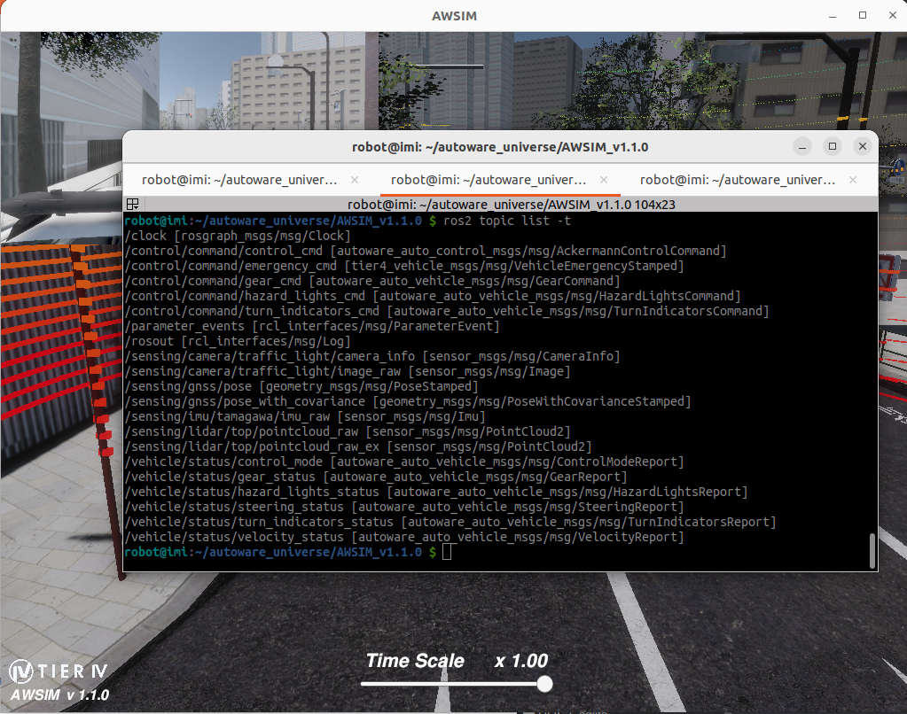

### AWSIM 

（缺点是只能用来跑官方的自动驾驶程序，不能单独控制，可操作性较差）

- Ubuntu : 22.04
- ROS2 : humble
- Sensors : 
  - Gnss * 1
    IMU * 1
    LiDAR * 1
    Traffic camera * 1

| Required PC Specs         |                               |
| ------------------------- | ----------------------------- |
| OS                        | Ubuntu 22.04                  |
| CPU                       | 6cores and 12thread or higher |
| GPU                       | RTX2080Ti or higher           |
| Nvidia Driver (Windows)   | >=472.50                      |
| Nvidia Driver (Ubuntu 22) | >=515.43.04                   |

 **AWSIM**是Autoware当前推荐使用的仿真工具，内部采用ros2-for-unity插件，能够直接发送ros2消息而不同采用中间转接模块，效率较高 。可以参考下面的官方安装链接 :

```
https://tier4.github.io/AWSIM/GettingStarted/QuickStartDemo/
```


### 安装

- 1、本地主机设置

模拟基于适当的网络设置，允许 AWSIM 模拟与 Autoware 软件的无故障通信。要应用所需的本地主机设置，请将以下行添加到`~/.bashrc`文件中 ：

```sh
export ROS_LOCALHOST_ONLY=1
export RMW_IMPLEMENTATION=rmw_cyclonedds_cpp
alias awsim="~/autoware_universe/AWSIM_v1.1.0/AWSIM_demo.x86_64"

if [ ! -e /tmp/cycloneDDS_configured ]; then
    sudo sysctl -w net.core.rmem_max=2147483647
    sudo ip link set lo multicast on
    touch /tmp/cycloneDDS_configured
fi
```

- 2、安装nvida驱动

直接在ubuntu software里面装驱动

- 3、安装 Vulkan 图形库

```sh
sudo apt update
sudo apt install libvulkan1
sudo apt install ros-humble-rmw-cyclonedds-cpp
```

- 4、下载AWSIM二进制文件

```http
https://github.com/tier4/AWSIM/releases/download/v1.1.0/AWSIM_v1.1.0.zip
```

解压缩下载文件，然后使`AWSIM_demo.x86_64`文件可执行，对其赋予权限

```sh
# 一般下载后就已经有权限了
chmod +x ~/autoware_universe/AWSIM_v1.1.0/AWSIM_demo.x86_64
```

- 5、启动

进入 ~/autoware_universe/AWSIM_v1.1.0/ 目录，然后直接启动即可 ：

```sh
cd ~/autoware_universe/AWSIM_v1.1.0
# 启动
./AWSIM_demo.x86_64
```





### 快捷配置

在 bashrc 中添加 alias 快捷启动映射

```sh
alias awsim="~/autoware_universe/AWSIM_v1.1.0/AWSIM_demo.x86_64"
```

