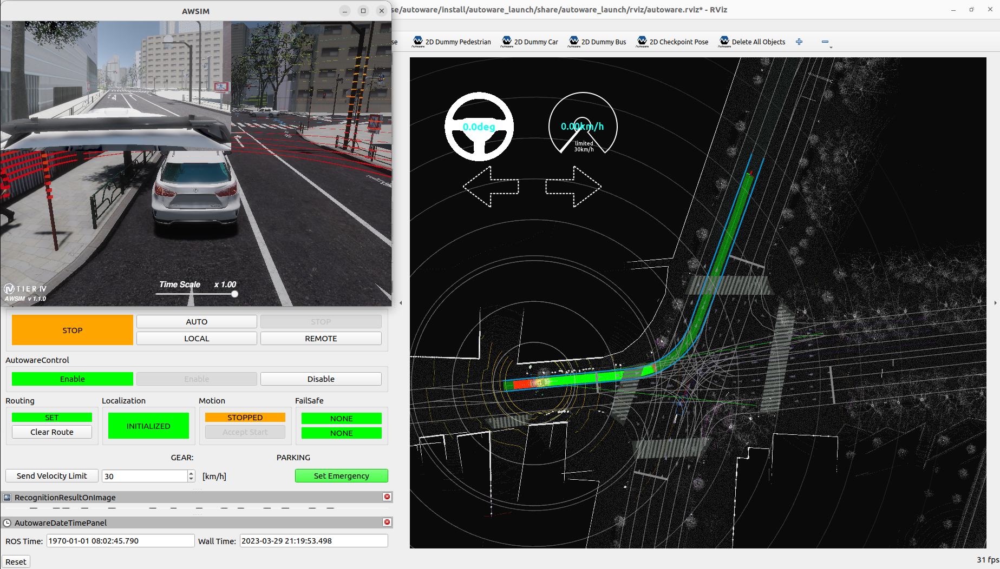
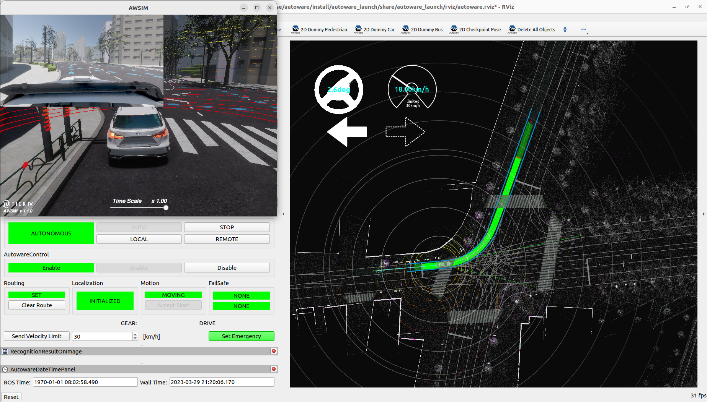

### autoware_AWSIM

AWSIM仿真器打开后直接就有各传感器数据了，然后就只需要配置autoware即可，这里需要切换下autoware.universe的版本，还是按照官方的版本再依次配置下 ：

### 源码

按照官方给的方法安装源码 ：https://tier4.github.io/AWSIM/GettingStarted/QuickStartDemo/

```sh
git clone https://github.com/autowarefoundation/autoware.git
cd autoware
# 切换分支
git checkout awsim-stable
# 运行安装脚本
./setup-dev-env.sh
# 拉取源文件 ， 这里建议对autoware.repos中的github链接添加代理
mkdir src
vcs import src < autoware.repos
# 安装依赖
source /opt/ros/humble/setup.bash
rosdep update
rosdep install -y --from-paths src --ignore-src --rosdistro $ROS_DISTRO
# 编译
colcon build --symlink-install --cmake-args -DCMAKE_BUILD_TYPE=Release -DCMAKE_CXX_FLAGS="-w"
```

### 地图

下载地图，这里放到 ~/autoware_universe/autoware_map ，重命名为 awsim_autoware_map ，下载地址 ：

```http
https://github.com/tier4/AWSIM/releases/download/v1.1.0/nishishinjuku_autoware_map.zip
```

### 启动

- 运行 launch 启动文件 

首先确保上面的autoware编译通过，然后运行launch启动文件

```sh
source ~/autoware_universe/autoware/install/setup.bash
ros2 launch autoware_launch e2e_simulator.launch.xml vehicle_model:=sample_vehicle sensor_model:=awsim_sensor_kit map_path:=$HOME/autoware_universe/autoware_map/awsim_autoware_map
```

- 设置目标点



- 自动驾驶


