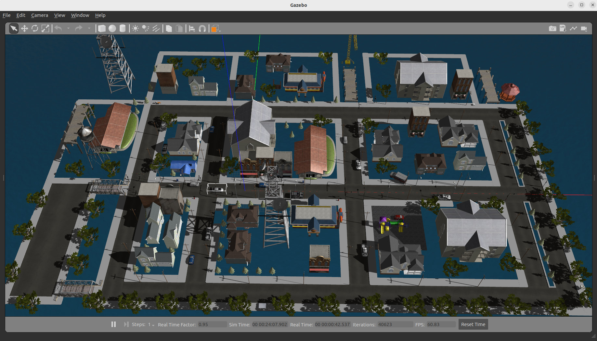

### gazebo

gazebo是ros老牌的仿真器了，安装了ros2就默认安装了gazebo仿真器，这里使用gazebo仿真器是因为其支持 velodyne_simulator 16线激光雷达，其中包含了lidarslam、lio-sam 3D slam 所需要的所有点云属性，并且后面将会用到，且得到验证的确可行

### autoware_gazebo

autoware_gazebo功能包中包含了自动驾驶车辆即适配传感器的仿真环境，可直接进行参考，同时在 dolly 城镇环境基础上进行修改，增加建筑物提高点云特征点，避免后面使用 3D slam 时因为特征点过少激光里程计漂移比较严重的问题，启动方式如下 ：

```sh
ros2 launch autoware_gazebo autoware_car_launch.py
```




### Gazebo 插件 

可以参考 gazebo 自带的 gazebo_plugins 里面的地图环境，路径如下 ：

```sh
/opt/ros/humble/share/gazebo_plugins/worlds
```


### gazebo模型

必须下载否则不能正常打开 gazebo 仿真环境 ：

```sh
cd ~/.gazebo
git clone https://ghproxy.com/https://github.com/osrf/gazebo_models.git
mv gazebo_models/* models ; rm -r gazebo_models

# 把下面这个添加到 .bashrc 里面
source /usr/share/gazebo/setup.sh
```


### autoware_sim_ws

这是基于gazebo的autoware.universe仿真功能包，clone 最新的功能包 ：

```sh
# 1、源码
mkdir autoware_sim_ws ; cd autoware_sim_ws
git clone git@gitee.com:QY_Benny/autoware_car.git
mv autoware_car src
# 2、依赖安装
rosdep install --from-paths src --ignore-src -r -y
# lio-sam 依赖 
sudo apt install ros-$ROS_DISTRO-perception-pcl \
  	   ros-$ROS_DISTRO-pcl-msgs \
  	   ros-$ROS_DISTRO-vision-opencv \
  	   ros-$ROS_DISTRO-xacro
 
# 按enter继续
sudo add-apt-repository ppa:borglab/gtsam-release-4.1
sudo apt install libgtsam-dev libgtsam-unstable-dev

# 3、编译
colcon build --cmake-args -DCMAKE_BUILD_TYPE=Release
```

