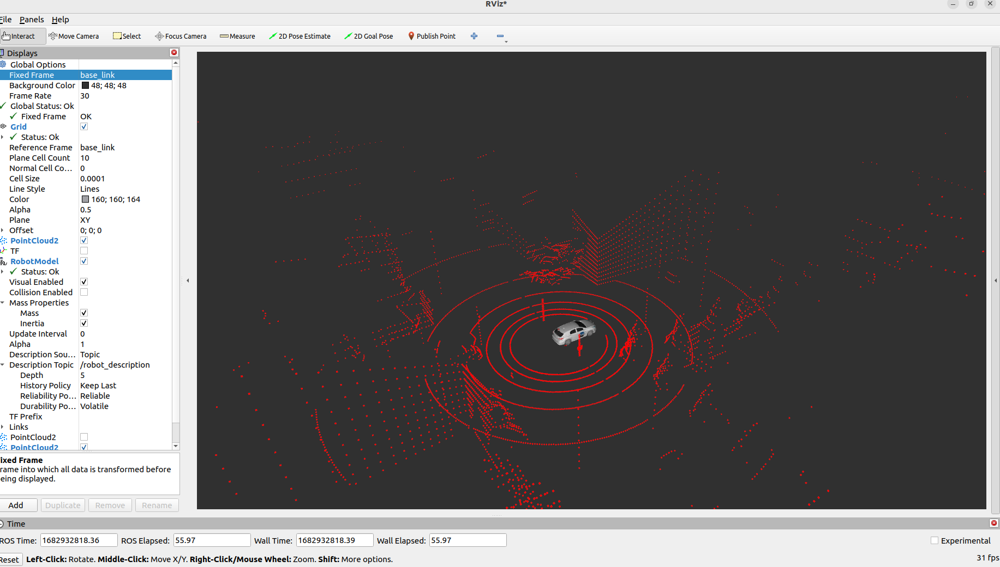

### gazebo 适配 vehicle

awsim 模拟器中发布了与vehicle相关的一些话题，这里需要花点时间去了解下，因为直接在gazebo中没有发布这些话题，但是启动autoware.launch文件时又会启动异常，对比搭建的gazebo环境和awsim发现传感器话题一致，唯一的区别就是vehicle相关的话题，如下 ：

```clojure
 * /vehicle/status/control_mode [autoware_auto_vehicle_msgs/msg/ControlModeReport] 1 publisher
 * /vehicle/status/gear_status [autoware_auto_vehicle_msgs/msg/GearReport] 1 publisher
 * /vehicle/status/hazard_lights_status [autoware_auto_vehicle_msgs/msg/HazardLightsReport] 1 publisher
 * /vehicle/status/steering_status [autoware_auto_vehicle_msgs/msg/SteeringReport] 1 publisher
 * /vehicle/status/turn_indicators_status [autoware_auto_vehicle_msgs/msg/TurnIndicatorsReport] 1 publisher
 * /vehicle/status/velocity_status [autoware_auto_vehicle_msgs/msg/VelocityReport] 1 publisher
```

|    S/P    |                  话题                  |                        类型                         |                             描述                             |
| :-------: | :------------------------------------: | :-------------------------------------------------: | :----------------------------------------------------------: |
| publisher |      /vehicle/status/control_mode      |  autoware_auto_vehicle_msgs/msg/ControlModeReport   |      车辆控制模式(自动/手动)，默认数据mode为1，自动模式      |
| publisher |      /vehicle/status/gear_status       |      autoware_auto_vehicle_msgs/msg/GearReport      |    齿轮状态，默认report为22，第一次运动起来后report就为2     |
| publisher |  /vehicle/status/hazard_lights_status  |  autoware_auto_vehicle_msgs/msg/HazardLightsReport  |              危险指示灯 _ 状态 ，默认report为1               |
| publisher |    /vehicle/status/steering_status     |    autoware_auto_vehicle_msgs/msg/SteeringReport    | 驾驶过程中的航向角,默认steering_tire_angle为 0.0角度；这是阿克曼前轮转向角度值 。 |
| publisher | /vehicle/status/turn_indicators_status | autoware_auto_vehicle_msgs/msg/TurnIndicatorsReport | 转换指示器状态，默认report为1，左转指示灯为2，右转指示灯为3  |
| publisher |    /vehicle/status/velocity_status     |    autoware_auto_vehicle_msgs/msg/VelocityReport    | 速度状态，默认frame_id: base_link<br />longitudinal_velocity(纵向速度x): 0.0<br/>lateral_velocity(横向速度z): -0.0<br/>heading_rate: 5.326322207110934e-05 |

- /vehicle/status/steering_status   ： rviz 中角度值

- /vehicle/status/velocity_status   ： rviz 中速度值

### 一、vehicle 数据

订阅gazebo发布的odom数据，用于发布上面的相关数据，在autoware_gazebo_utils 里面新建 vehlicle_gazebo_pub.py 文件用于发布对应的话题 ：

```python
#!/usr/bin/env python3
import rclpy
from rclpy.node import Node
from nav_msgs.msg import Odometry
from autoware_auto_vehicle_msgs.msg import ControlModeReport,GearReport,HazardLightsReport,SteeringReport,TurnIndicatorsReport,VelocityReport
import math

class vehlicle_gazebo_pub(Node):
    def __init__(self,node_name):
        super().__init__(node_name)
        self.get_logger().info("vehlicle gazebo pub .")
        self.odom_msg = Odometry()
        self.odom_sub = self.create_subscription(Odometry,"odom",self.odom_sub_callback,10)
        # publisher
        self.control_mode_msgs = ControlModeReport() ; self.control_mode_msgs.mode = 1
        self.control_mode_pub = self.create_publisher(ControlModeReport,"/vehicle/status/control_mode",10)

        self.gear_status_msgs = GearReport() ; self.gear_status_msgs.report = 22 ;self.gear_status_init_flag = False
        self.gear_status_pub = self.create_publisher(GearReport,"/vehicle/status/gear_status",10)

        self.hazard_lights_status_msgs = HazardLightsReport() ; self.hazard_lights_status_msgs.report = 1
        self.hazard_lights_status_pub = self.create_publisher(HazardLightsReport,"/vehicle/status/hazard_lights_status",10)

        self.steering_status_msgs = SteeringReport() ; self.steering_status_msgs.steering_tire_angle = 0.0
        self.steering_status_pub = self.create_publisher(SteeringReport,"/vehicle/status/steering_status",10)

        self.turn_indicators_status_msgs = TurnIndicatorsReport() ; self.turn_indicators_status_msgs.report = 1
        self.turn_indicators_status_pub = self.create_publisher(TurnIndicatorsReport,"/vehicle/status/turn_indicators_status",10)

        self.velocity_status_msgs = VelocityReport() ; self.velocity_status_msgs.header.frame_id = "base_link" ; 
        self.velocity_status_msgs.longitudinal_velocity = 0.0 ; 
        self.velocity_status_msgs.lateral_velocity = 0.0 ; 
        self.velocity_status_msgs.heading_rate = 5.326322207110934e-05 ; 
        self.velocity_status_pub = self.create_publisher(VelocityReport,"/vehicle/status/velocity_status",10)

    def odom_sub_callback(self,date):
        self.odom_msg = date
        if self.gear_status_init_flag == False :
            if abs(self.odom_msg.twist.twist.linear.x) > 0.01 or abs(self.odom_msg.twist.twist.angular.z) > 0.01 :
                self.odom_msg.twist.twist.linear.x = 0.0
                # print(self.odom_msg.twist.twist.linear.x , self.odom_msg.twist.twist.angular.z)
                self.gear_status_init_flag = True
                self.gear_status_msgs.report = 2
                # self.get_logger().warn("vel : %f %f"%(abs(self.odom_msg.twist.twist.linear.x),abs(self.odom_msg.twist.twist.angular.z)))
        
        if abs(self.odom_msg.twist.twist.linear.x) < 0.01 :
            self.odom_msg.twist.twist.linear.x = 0.0

        if abs(self.odom_msg.twist.twist.angular.z) < 0.01 :
            self.odom_msg.twist.twist.angular.z = 0.0
        
        

        self.velocity_status_msgs.longitudinal_velocity = self.odom_msg.twist.twist.linear.x
        self.velocity_status_msgs.lateral_velocity = self.odom_msg.twist.twist.linear.y
        self.velocity_status_msgs.heading_rate = self.angular2degree()
        self.steering_status_msgs.steering_tire_angle = self.angular2degree()

        self.control_mode_msgs.stamp = self.get_clock().now().to_msg()
        self.gear_status_msgs.stamp = self.get_clock().now().to_msg()
        self.hazard_lights_status_msgs.stamp = self.get_clock().now().to_msg()
        self.steering_status_msgs.stamp = self.get_clock().now().to_msg()
        self.turn_indicators_status_msgs.stamp = self.get_clock().now().to_msg()
        self.velocity_status_msgs.header.stamp = self.get_clock().now().to_msg()

        self.control_mode_pub.publish(self.control_mode_msgs)
        self.gear_status_pub.publish(self.gear_status_msgs)
        self.hazard_lights_status_pub.publish(self.hazard_lights_status_msgs)
        self.steering_status_pub.publish(self.steering_status_msgs)
        self.turn_indicators_status_pub.publish(self.turn_indicators_status_msgs)
        self.velocity_status_pub.publish(self.velocity_status_msgs)
    
    def angular2degree(self):
        wheelbase = 1.52  # 小车轮距
        lenbase = 2.86    # 小车轴距
        inner_angle =  0.0
        # 内轮转角 = arctan(车子轴距 * 角速度 / 车子线速度)
        # 其中，车子轴距是车子前后轮的距离，角速度是车子绕垂直于地面的轴旋转的速率，车子线速度是车子沿着地面运动的速率。
        if self.odom_msg.twist.twist.linear.x != 0 and self.odom_msg.twist.twist.angular.z != 0 :
            # inner_angle = (2 * self.odom_msg.twist.twist.linear.x) / (wheelbase * self.odom_msg.twist.twist.angular.z)
            inner_angle = math.atan(lenbase * self.odom_msg.twist.twist.angular.z / self.odom_msg.twist.twist.linear.x)
        return inner_angle


def main(args=None):
    rclpy.init(args=args)			    
    vehlicle_gazebo_pub_node = vehlicle_gazebo_pub("vehlicle_gazebo_pub_node")    
    rclpy.spin(vehlicle_gazebo_pub_node)                 
    rclpy.shutdown()

main()
```

### 二、运行

在 autoware_gazebo_launch/launch/utils/ 中新建 gazebo_vehicle.launch.xml启动文件，用于启动rviz2中显示的车辆模型和tf2变换，其中config_dir使用的是上一节我们提取出来的autoware_gazebo_individual_params中的参数；同时在里面启动了矢量地图加载的程序，如果不需要可以注释掉 ：

```xml
<?xml version="1.0" encoding="UTF-8"?>
<launch>
  <!-- Essential parameters -->
  <arg name="map_path" default="/home/robot/autoware_universe/autoware_map/gazebo_map" description="point cloud and lanelet2 map directory path"/>
  <arg name="vehicle_model" default="sample_vehicle" description="vehicle model name"/>
  <!-- sample_sensor_kit awsim_sensor_kit  -->
  <arg name="sensor_model" default="sample_sensor_kit" description="sensor model name"/>
  <arg name="use_pointcloud_container" default="false" description="launch pointcloud container"/>
  <arg name="pointcloud_container_name" default="pointcloud_container"/>

  <!-- Optional parameters -->
  <!-- Modules to be launched -->
  <arg name="launch_vehicle" default="true" description="launch vehicle"/>
  <arg name="launch_map" default="true" description="launch map"/>

  <!-- Global parameters -->
  <arg name="use_sim_time" default="true" description="use_sim_time"/>
  <!-- Vehicle -->
  <arg name="vehicle_id" default="$(env VEHICLE_ID default)" description="vehicle specific ID"/>
  <arg name="launch_vehicle_interface" default="true" description="launch vehicle interface"/>
  <!-- Map -->
  <arg name="lanelet2_map_file" default="lanelet2_map.osm" description="lanelet2 map file name"/>
  <arg name="pointcloud_map_file" default="pointcloud_map.pcd" description="pointcloud map file name"/>

  <!-- Global parameters -->
  <group scoped="false">
    <include file="$(find-pkg-share global_parameter_loader)/launch/global_params.launch.py">
      <arg name="use_sim_time" value="$(var use_sim_time)"/>
      <arg name="vehicle_model" value="$(var vehicle_model)"/>
    </include>
  </group>

  <!-- Vehicle -->
  <group if="$(var launch_vehicle)">
    <include file="$(find-pkg-share tier4_vehicle_launch)/launch/vehicle.launch.xml">
      <arg name="vehicle_model" value="$(var vehicle_model)"/>
      <arg name="sensor_model" value="$(var sensor_model)"/>
      <arg name="vehicle_id" value="$(var vehicle_id)"/>
      <arg name="launch_vehicle_interface" value="$(var launch_vehicle_interface)"/>
      <arg name="config_dir" value="$(find-pkg-share autoware_gazebo_individual_params)/config/$(var vehicle_id)/$(var sensor_model)"/>
    </include>
  </group>

  <!-- Map -->
  <group if="$(var launch_map)">
    <include file="$(find-pkg-share autoware_launch)/launch/components/tier4_map_component.launch.xml"/>
  </group>

  <!-- <group>
    <node pkg="rviz2" exec="rviz2" name="rviz2" output="screen" args="-d $(var rviz_config) -s $(find-pkg-share autoware_launch)/rviz/image/autoware.png" if="$(var rviz)"/>
  </group> -->
</launch>
```

执行下面的指令运行程序：

```sh
# 启动gazebo仿真环境
ros2 launch autoware_gazebo autoware_car_universe_launch.py
# 启动 gazebo_vehicle.launch.xml
ros2 launch autoware_gazebo_launch gazebo_vehicle.xml
```

由于这里定位没有启动map和base_link还没有动态连接起来。因此全局Fixed Frame选择map将显示地图，如果选择base_link将显示雷达和车辆 ：


