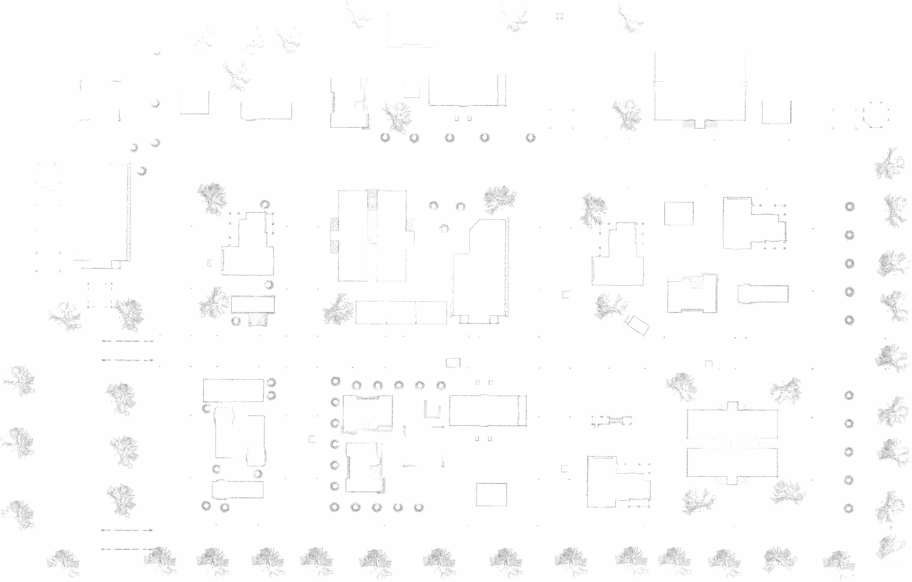

## pcd2map

将pcd点云文件转为2D栅格地图，可以使用栅格地图结合navgation2实现自动驾驶导航功能，目前找到的pcd2map功能包只有ROS1版本，但是测试效果还是很不错的，源码链接如下所示 ：

```http
https://github.com/Hinson-A/pcd2pgm_package
```

这里我对pcd2map功能包做了升级，包含ros1和ros2两个分支 ：

```sh
https://gitee.com/QY_Benny/pcd2map
# 克隆
git clone git@gitee.com:QY_Benny/pcd2map.git
```

### 一、ROS1 运行

首先配置 run.launch 文件夹中的pcd文件路径以及点云处理的参数，参考如下 ：

```xml
<!-- -->
<launch>
<node pkg="pcd2pgm" name="pcd2pgm" type="pcd2pgm" output="screen">
<!-- 存放pcd文件的路径-->
<param name="file_directory" value= "/home/robot/catkin_ws/src/pcd2pgm_package/pcd2pgm/map/" />
<!-- pcd文件名称-->
<param name="file_name" value= "pointcloud_map" />
<!-- 选取的范围　最小的高度-->
<param name="thre_z_min" value= "0.0" />
<!-- 选取的范围　最大的高度-->
<param name="thre_z_max" value= "1.7" />
<!--0 选取高度范围内的，１选取高度范围外的-->
<param name="flag_pass_through" value= "0" />
<!-- 半径滤波的半径-->
<param name="thre_radius" value= "0.5" />
<!-- 半径滤波的要求点数个数-->
<param name="thres_point_count" value= "10" />
<!-- 存储的栅格map的分辨率-->
<param name="map_resolution" value= "0.05" />
<!-- 转换后发布的二维地图的topic，默认使用map即可，可使用map_server保存-->
<param name="map_topic_name" value= "map" />
</node>
</launch>

```

然后运行 pcd2map 即可 ，这时候会出现 /map 的话题，我尝试直接用rviz查看map地图但是没有显示 .

```sh
roslaunch pcd2pgm run.launch
```

地图保存，使用 map_server 工具 ：

```sh
# 在相应的路径下执行下面指令，保存地图并命名为map
rosrun map_server map_saver -f map
```


### 二、ROS2 

需要对源码做修改，适配ROS2 Humble版本，参考如下 ：

#### 1、pcd2pgm.cpp

```cpp
#include "rclcpp/rclcpp.hpp"

#include "nav_msgs/msg/occupancy_grid.hpp"

#include <pcl/io/pcd_io.h>
#include <pcl_conversions/pcl_conversions.h>

#include "sensor_msgs/msg/point_cloud2.hpp"

#include <pcl/filters/conditional_removal.h>         //条件滤波器头文件
#include <pcl/filters/passthrough.h>                 //直通滤波器头文件
#include <pcl/filters/radius_outlier_removal.h>      //半径滤波器头文件
#include <pcl/filters/statistical_outlier_removal.h> //统计滤波器头文件
#include <pcl/filters/voxel_grid.h>                  //体素滤波器头文件
#include <pcl/point_types.h>

std::string file_directory;
std::string file_name;
std::string pcd_file;

std::string map_topic_name;

const std::string pcd_format = ".pcd";

std::shared_ptr<rclcpp::Node> node ;
nav_msgs::msg::OccupancyGrid map_topic_msg;

//最小和最大高度
double thre_z_min = 0.3;
double thre_z_max = 2.0;
int flag_pass_through = 0;
double map_resolution = 0.05;
double thre_radius = 0.1;
//半径滤波的点数阈值
int thres_point_count = 10;

//直通滤波后数据指针
pcl::PointCloud<pcl::PointXYZ>::Ptr
    cloud_after_PassThrough(new pcl::PointCloud<pcl::PointXYZ>);
//半径滤波后数据指针
pcl::PointCloud<pcl::PointXYZ>::Ptr
    cloud_after_Radius(new pcl::PointCloud<pcl::PointXYZ>);
pcl::PointCloud<pcl::PointXYZ>::Ptr
    pcd_cloud(new pcl::PointCloud<pcl::PointXYZ>);

//直通滤波
void PassThroughFilter(const double &thre_low, const double &thre_high,
                      const bool &flag_in);
//半径滤波
void RadiusOutlierFilter(const pcl::PointCloud<pcl::PointXYZ>::Ptr &pcd_cloud,
                        const double &radius, const int &thre_count);
//转换为栅格地图数据并发布
void SetMapTopicMsg(const pcl::PointCloud<pcl::PointXYZ>::Ptr cloud,
                    nav_msgs::msg::OccupancyGrid &msg);

int main(int argc, char **argv) {
  rclcpp::init(argc, argv);
  node = rclcpp::Node::make_shared("pcl_filters");
  rclcpp::Rate loop_rate(1);				         			// 频率1HZ，即 1s

  node->declare_parameter("file_directory",std::string("/home/"));
  node->declare_parameter("file_name",std::string("map"));
  node->declare_parameter("thre_z_min", 0.2);
  node->declare_parameter("thre_z_max", 2.0);
  node->declare_parameter("flag_pass_through", false);
  node->declare_parameter("thre_radius", 0.5);
  node->declare_parameter("map_resolution", 0.05);
  node->declare_parameter("thres_point_count", 10);
  node->declare_parameter("map_topic_name", std::string("map"));

  std::string file_directory = node->get_parameter("file_directory").as_string();
  std::string file_name = node->get_parameter("file_name").as_string();
  double thre_z_min = node->get_parameter("thre_z_min").as_double();
  double thre_z_max = node->get_parameter("thre_z_max").as_double();
  bool flag_pass_through = node->get_parameter("flag_pass_through").as_bool();
  double thre_radius = node->get_parameter("thre_radius").as_double();
  double map_resolution = node->get_parameter("map_resolution").as_double();
  int thres_point_count = node->get_parameter("thres_point_count").as_int();
  std::string map_topic_name = node->get_parameter("map_topic_name").as_string();

  pcd_file = file_directory + file_name + pcd_format;

  rclcpp::Publisher<nav_msgs::msg::OccupancyGrid>::SharedPtr map_topic_pub;
  map_topic_pub = node->create_publisher<nav_msgs::msg::OccupancyGrid>(map_topic_name,rclcpp::QoS(rclcpp::KeepLast(1)).transient_local().reliable());

  // 下载pcd文件
  if (pcl::io::loadPCDFile<pcl::PointXYZ>(pcd_file, *pcd_cloud) == -1) {
    PCL_ERROR("Couldn't read file: %s \n", pcd_file.c_str());
    return (-1);
  }

  std::cout << "初始点云数据点数：" << pcd_cloud->points.size() << std::endl;
  //对数据进行直通滤波
  PassThroughFilter(thre_z_min, thre_z_max, bool(flag_pass_through));
  //对数据进行半径滤波
  RadiusOutlierFilter(cloud_after_PassThrough, thre_radius, thres_point_count);
  //转换为栅格地图数据并发布
  SetMapTopicMsg(cloud_after_Radius, map_topic_msg);
  // SetMapTopicMsg(cloud_after_PassThrough, map_topic_msg);

  while (rclcpp::ok()) {
    rclcpp::spin_some(node) ;
    map_topic_pub->publish(map_topic_msg);
    loop_rate.sleep();
  }

  return 0;
}

//直通滤波器对点云进行过滤，获取设定高度范围内的数据
void PassThroughFilter(const double &thre_low, const double &thre_high,
                      const bool &flag_in) {
  // 创建滤波器对象
  pcl::PassThrough<pcl::PointXYZ> passthrough;
  //输入点云
  passthrough.setInputCloud(pcd_cloud);
  //设置对z轴进行操作
  passthrough.setFilterFieldName("z");
  //设置滤波范围
  passthrough.setFilterLimits(thre_low, thre_high);
  // true表示保留滤波范围外，false表示保留范围内
  passthrough.setFilterLimitsNegative(flag_in);
  //执行滤波并存储
  passthrough.filter(*cloud_after_PassThrough);
  // test 保存滤波后的点云到文件
  pcl::io::savePCDFile<pcl::PointXYZ>(file_directory + "map_filter.pcd",
                                      *cloud_after_PassThrough);
  std::cout << "直通滤波后点云数据点数："
            << cloud_after_PassThrough->points.size() << std::endl;
}

//半径滤波
void RadiusOutlierFilter(const pcl::PointCloud<pcl::PointXYZ>::Ptr &pcd_cloud0,
                        const double &radius, const int &thre_count) {
  //创建滤波器
  pcl::RadiusOutlierRemoval<pcl::PointXYZ> radiusoutlier;
  //设置输入点云
  radiusoutlier.setInputCloud(pcd_cloud0);
  //设置半径,在该范围内找临近点
  radiusoutlier.setRadiusSearch(radius);
  //设置查询点的邻域点集数，小于该阈值的删除
  radiusoutlier.setMinNeighborsInRadius(thre_count);
  radiusoutlier.filter(*cloud_after_Radius);
  // test 保存滤波后的点云到文件
  pcl::io::savePCDFile<pcl::PointXYZ>(file_directory + "map_radius_filter.pcd",
                                      *cloud_after_Radius);
  std::cout << "半径滤波后点云数据点数：" << cloud_after_Radius->points.size()
            << std::endl;
}

//转换为栅格地图数据并发布
void SetMapTopicMsg(const pcl::PointCloud<pcl::PointXYZ>::Ptr cloud,
                    nav_msgs::msg::OccupancyGrid &msg) {
  msg.header.stamp = node->now();
  msg.header.frame_id = "map";

  msg.info.map_load_time = node->now();
  msg.info.resolution = map_resolution;

  double x_min, x_max, y_min, y_max;
  double z_max_grey_rate = 0.05;
  double z_min_grey_rate = 0.95;
  //? ? ??
  double k_line =
      (z_max_grey_rate - z_min_grey_rate) / (thre_z_max - thre_z_min);
  double b_line =
      (thre_z_max * z_min_grey_rate - thre_z_min * z_max_grey_rate) /
      (thre_z_max - thre_z_min);

  if (cloud->points.empty()) {
    RCLCPP_WARN(rclcpp::get_logger("rclcpp"), "pcd is empty!\n");
    return;
  }

  for (int i = 0; i < cloud->points.size() - 1; i++) {
    if (i == 0) {
      x_min = x_max = cloud->points[i].x;
      y_min = y_max = cloud->points[i].y;
    }

    double x = cloud->points[i].x;
    double y = cloud->points[i].y;

    if (x < x_min)
      x_min = x;
    if (x > x_max)
      x_max = x;

    if (y < y_min)
      y_min = y;
    if (y > y_max)
      y_max = y;
  }
  // origin的确定
  msg.info.origin.position.x = x_min;
  msg.info.origin.position.y = y_min;
  msg.info.origin.position.z = 0.0;
  msg.info.origin.orientation.x = 0.0;
  msg.info.origin.orientation.y = 0.0;
  msg.info.origin.orientation.z = 0.0;
  msg.info.origin.orientation.w = 1.0;
  //设置栅格地图大小
  msg.info.width = int((x_max - x_min) / map_resolution);
  msg.info.height = int((y_max - y_min) / map_resolution);
  //实际地图中某点坐标为(x,y)，对应栅格地图中坐标为[x*map.info.width+y]
  msg.data.resize(msg.info.width * msg.info.height);
  msg.data.assign(msg.info.width * msg.info.height, 0);

  RCLCPP_INFO(rclcpp::get_logger("rclcpp"), "data size = %d\n", msg.data.size());

  for (int iter = 0; iter < cloud->points.size(); iter++) {
    int i = int((cloud->points[iter].x - x_min) / map_resolution);
    if (i < 0 || i >= msg.info.width)
      continue;

    int j = int((cloud->points[iter].y - y_min) / map_resolution);
    if (j < 0 || j >= msg.info.height - 1)
      continue;
    // 栅格地图的占有概率[0,100]，这里设置为占据
    msg.data[i + j * msg.info.width] = 100;
    //    msg.data[i + j * msg.info.width] = int(255 * (cloud->points[iter].z *
    //    k_line + b_line)) % 255;
  }
}
```

#### 2、run.launch.py

新建launch启动文件，参考如下 ：

```python
import os
from launch import LaunchDescription
from launch.substitutions import LaunchConfiguration
from launch.actions import DeclareLaunchArgument
from launch_ros.actions import Node
from ament_index_python.packages import get_package_share_directory

def generate_launch_description():
    use_sim_time = LaunchConfiguration('use_sim_time', default=True)
    file_directory = os.path.join(get_package_share_directory('pcd2pgm'),'map/')
    # pcd2pgm node 启动
    pcd2pgm = Node(
        package='pcd2pgm',
        executable='pcd2map',
        name='pcd2map',
        output='screen',
        parameters=[{'use_sim_time': use_sim_time , 
                    'file_directory': file_directory ,  # 存放pcd文件的路径 
                    'file_name' : "pointcloud_map" ,    # pcd文件名称
                    'thre_z_min' : 0.0 ,                # 选取的范围　最小的高度
                    'thre_z_max' : 1.5 ,                # 选取的范围　最大的高度
                    'flag_pass_through' : False ,       # 0 选取高度范围内的，１选取高度范围外的
                    'thre_radius' : 5.0 ,               # 半径滤波的半径
                    'thres_point_count' : 10 ,          # 半径滤波的要求点数个数
                    'map_resolution' : 0.05 ,           # 存储的栅格map的分辨率
                    'map_topic_name' : "map" ,}],       # 转换后发布的二维地图的topic，默认使用map即可，可使用map_server保存
    )

    return LaunchDescription([
        DeclareLaunchArgument(
            'use_sim_time',
            default_value='true',
            description='Use simulation (Gazebo) clock if true'),
        pcd2pgm,
    ])
```

#### 3、启动

```sh
ros2 launch pcd2pgm run.launch.py
```

#### 4、地图保存

```
ros2 run nav2_map_server map_saver_cli -f map
```



对应生成的 map.yaml 如下 ：

```yaml
image: map.pgm
mode: trinary
resolution: 0.05
origin: [-75.1, -54.6, 0]
negate: 0
occupied_thresh: 0.65
free_thresh: 0.25
```

