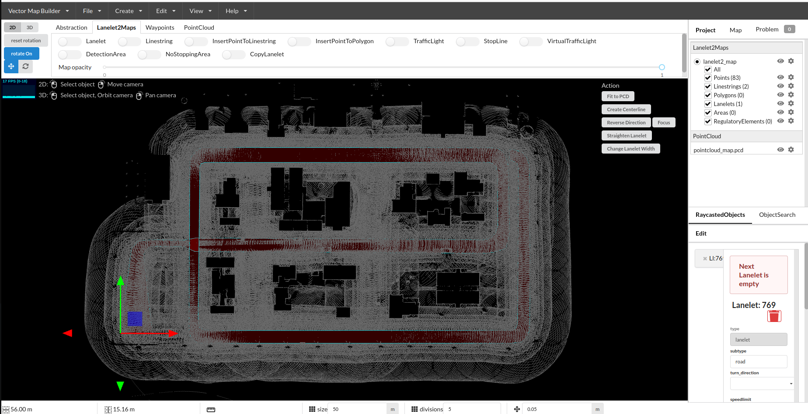
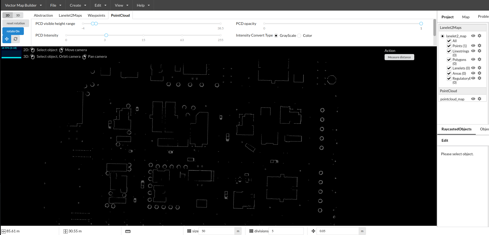
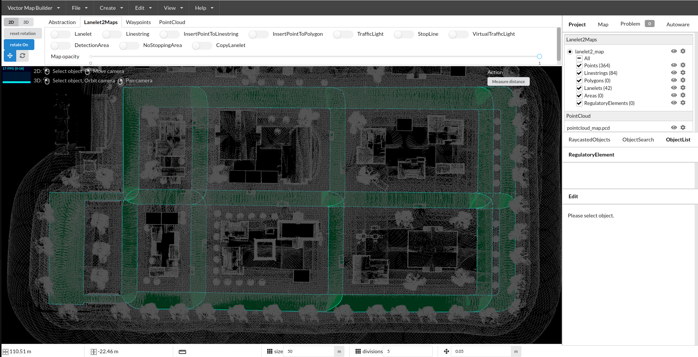

### vector_map_builder

用之前的 pcd 点云地图制作高精度矢量地图，autoware官方提供了一个在线的制作网址，参考如下

```sh
# autoware 教程地址
https://tier4.github.io/AWSIM/Components/Environment/AddNewEnvironment/
# vector_map_builder网址 ，选择1.13版本
https://tools.tier4.jp/
# 官方教程
https://tools.tier4.jp/vector_map_builder/user_guide/

# b站教学视频
https://www.bilibili.com/video/BV1Ku411f7xi/?spm_id_from=333.337.search-card.all.click&vd_source=1b7497ac795ba5efb2c237e07919ac3f
```

### 步骤

- 1、进入vector_map_builder网页，选择 1.13 版本 ；
- 2、导入 pcd 点云文件，file->import PCD ；
- 3、create Lanelet2Maps ，命名为lanelet2_map ；
- 4、选择Lanelet2Maps添加对应的组件，这里尝试最简单的 Lanelet 道路，然后根据实际情况进行调整，在gazebo仿真中道路比较狭窄，这里我就仅设置为单行道，并将车道尽可能的宽给导航用 ；
- 5、导出地图 ，File -> Export Lanelet2maps ，得到 lanelet2_map.osm 文件



注意在绘制道路时点云可能会挡住视线，这里可以通过设置点云的高度过滤从而减少点云的显示，如下所示 ：




### 绘制技巧

###### 1、使用 Linestring 更方便 ，其中有如下技巧 ：

- 继上Linstring绘制，先选中上一个Linstring的一个Point，然后点击 Linstring 即可继续绘制 ；
- 两条 Linstring 添加道路 Lanelet 属性，shift 选中两个 Linstring 然后点击 Add Lanelet


###### 2、道路 Lanelet 编辑，其中有如下技巧 ：

- 连接两条道路，同时选中 两个Lanelet ，点击 Add Join Lanelets (不推荐使用)选择左转还是右转，或者直行
- 道路反向，由于是日本的交通规则靠左行驶，选中 Lanelet 道路，如果坐标在道路左侧代表向前方向(正)；坐标在道路右侧代表向后方向(逆)；可以点击Reverse Direction进行道路反向 。
- 添加中心线 ，选中 Lanelet 道路，Create Centerline 即可创建一个中心线，然后选中中心线设置是否可以变道，set to enable lane change 。


###  优化

最后完善的地图是没有红色的区域，即地图形成闭环环绕，均呈现绿色 ：

