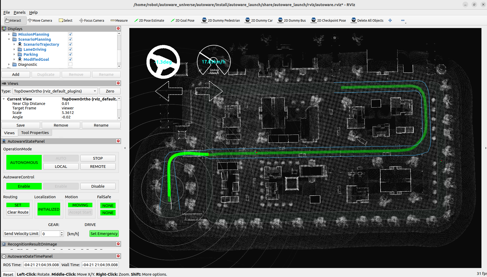
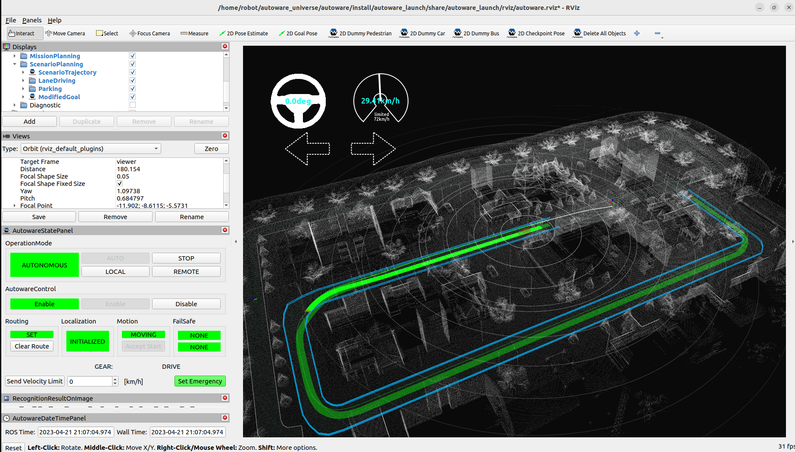
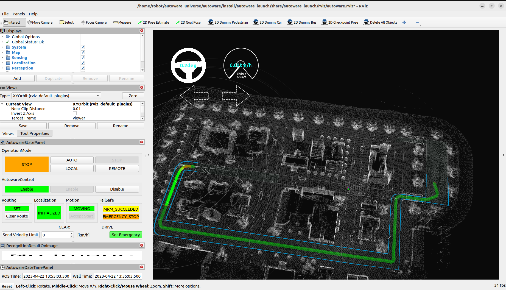

### rviz2_vector_map 导航

类似 02_Planning_simulation 章节的仿真实现，在 rviz2 里面加载矢量地图和点云信息，即可实现导航，目前地图比较简单，并没有绘制较为复杂的地图环境，也主要是受到gazebo环境尺寸设置略小的影响，转弯不太方便。

### 一、步骤

- 1、首先在 autoware_universe/autoware_map 中新建一个gazebo_map文件夹，里面存放适量地图 lanelet2_map.osm 和 点云地图 pointcloud_map.pcd
- 2、运行rviz2中的仿真程序 ，下面的地图路径需要跟上面相同，模型可以暂且使用autoware自带的模型，然后运行下面指令 ：

```sh
ros2 launch autoware_launch planning_simulator.launch.xml map_path:=$HOME/autoware_universe/autoware_map/gazebo_map vehicle_model:=sample_vehicle sensor_model:=sample_sensor_kit
```

- 3、给定初始位置，点击rviz2 中的 2D Pose Estimate 按键进行设置
- 4、设置目标点，点击rviz2 中的 2D Goal Pose 按键进行设置
- 5、开始导航，点击左边的AUTO按键






autoware 中控制车辆运动的话题消息类型是自定义的，查看运动控制指令 ：

```sh
ros2 topic echo /control/command/control_cmd
```


### 二、优化

优化地图可实现小车到达任意位置，形成环绕 ：



 

### 三、autoware_gazebo_launch

参照官方的案列 launcher/autoware_launch/autoware_launch ，将这个 pkg 功能包拉出来重命名为 autoware_gazebo_launch，该功能包可能是一个比较常改的启动地方，对于一些修改比较频繁的功能包可以拉出来就避免重复编译 autoware.universe 源码造成不必要的错误 ，保留官方该包的架构不变，新建 utils 文件夹用于存放自己的一些launch启动文件，比如该小节的仿真器快速启动launch文件为gazebo_planning_simulator.launch.xml，写入以下内容 ：

```xml
<?xml version="1.0" encoding="UTF-8"?>
<launch>
  <!-- Essential parameters -->
  <arg name="map_path" default="/home/robot/autoware_universe/autoware_map/gazebo_map" description="point cloud and lanelet2 map directory path"/>
  <arg name="vehicle_model" default="sample_vehicle" description="vehicle model name"/>
  <!-- sample_sensor_kit awsim_sensor_kit  -->
  <arg name="sensor_model" default="sample_sensor_kit" description="sensor model name"/>

  <!-- Optional parameters -->
  <!-- Map -->
  <arg name="lanelet2_map_file" default="lanelet2_map.osm" description="lanelet2 map file name"/>
  <arg name="pointcloud_map_file" default="pointcloud_map.pcd" description="pointcloud map file name"/>
  <!-- System -->
  <arg name="launch_system_monitor" default="false" description="launch system monitor"/>
  <arg name="launch_dummy_diag_publisher" default="false" description="launch dummy diag publisher"/>
  <!-- Tools -->
  <arg name="rviz" default="true" description="launch rviz"/>
  <arg name="rviz_config" default="$(find-pkg-share autoware_gazebo_launch)/rviz/autoware.rviz" description="rviz config"/>
  <!-- Scenario simulation -->
  <arg name="initial_engage_state" default="true" description="/vehicle/engage state after starting Autoware"/>
  <arg name="perception/enable_detection_failure" default="true" description="enable to simulate detection failure when using dummy perception"/>
  <arg name="perception/enable_object_recognition" default="true" description="enable object recognition when using dummy perception"/>
  <arg name="sensing/visible_range" default="300.0" description="visible range when using dummy perception"/>
  <arg name="scenario_simulation" default="false" description="use scenario simulation"/>
  <!-- Vcu emulation -->
  <arg name="vehicle_simulation" default="true" description="use vehicle simulation"/>

  <group scoped="false">
    <!-- Vehicle -->
    <let name="launch_vehicle_interface" value="false" if="$(var vehicle_simulation)"/>
    <let name="launch_vehicle_interface" value="true" unless="$(var vehicle_simulation)"/>

    <include file="$(find-pkg-share autoware_gazebo_launch)/launch/autoware.launch.xml">
      <!-- Common -->
      <arg name="map_path" value="$(var map_path)"/>
      <arg name="vehicle_model" value="$(var vehicle_model)"/>
      <arg name="sensor_model" value="$(var sensor_model)"/>
      <!-- Modules to be launched -->
      <arg name="launch_sensing" value="false"/>
      <arg name="launch_localization" value="false"/>
      <arg name="launch_perception" value="false"/>
      <!-- Pointcloud container -->
      <arg name="use_pointcloud_container" value="false"/>
      <!-- Vehicle -->
      <arg name="launch_vehicle_interface" value="$(var launch_vehicle_interface)"/>
      <!-- System -->
      <arg name="system_run_mode" value="planning_simulation"/>
      <arg name="launch_system_monitor" value="$(var launch_system_monitor)"/>
      <arg name="launch_dummy_diag_publisher" value="$(var launch_dummy_diag_publisher)"/>
      <!-- Map -->
      <arg name="lanelet2_map_file" value="$(var lanelet2_map_file)"/>
      <arg name="pointcloud_map_file" value="$(var pointcloud_map_file)"/>
      <!-- Tools -->
      <arg name="rviz" value="$(var rviz)"/>
      <arg name="rviz_config" value="$(var rviz_config)"/>
    </include>
  </group>

  <!-- Simulator -->
  <group>
    <let name="launch_dummy_perception" value="false" if="$(var scenario_simulation)"/>
    <let name="launch_dummy_perception" value="true" unless="$(var scenario_simulation)"/>
    <let name="launch_dummy_vehicle" value="false" if="$(var scenario_simulation)"/>
    <let name="launch_dummy_vehicle" value="true" unless="$(var scenario_simulation)"/>
    <let name="launch_dummy_localization" value="true"/>
    <let name="launch_diagnostic_converter" value="$(var scenario_simulation)"/>

    <include file="$(find-pkg-share autoware_gazebo_launch)/launch/components/tier4_simulator_component.launch.xml">
      <arg name="launch_dummy_perception" value="$(var launch_dummy_perception)"/>
      <arg name="launch_dummy_vehicle" value="$(var launch_dummy_vehicle)"/>
      <arg name="launch_dummy_localization" value="$(var launch_dummy_localization)"/>
      <arg name="launch_diagnostic_converter" value="$(var launch_diagnostic_converter)"/>
      <arg name="perception/enable_detection_failure" value="$(var perception/enable_detection_failure)"/>
      <arg name="perception/enable_object_recognition" value="$(var perception/enable_object_recognition)"/>
      <arg name="sensing/visible_range" value="$(var sensing/visible_range)"/>
      <arg name="vehicle_model" value="$(var vehicle_model)"/>
      <arg name="initial_engage_state" value="$(var initial_engage_state)"/>
      <arg name="vehicle_info_param_file" value="$(find-pkg-share $(var vehicle_model)_description)/config/vehicle_info.param.yaml"/>
    </include>
  </group>
</launch>
```

#### 快速启动

执行下面的launch文件然后给定初始位置就能实现该小节的仿真啦 ：

```sh
ros2 launch autoware_gazebo_launch gazebo_planning_simulator.launch.xml
```

