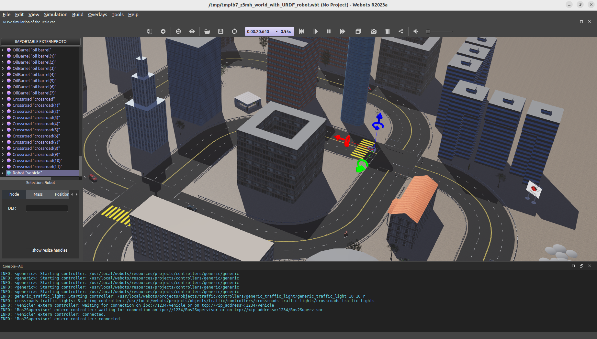
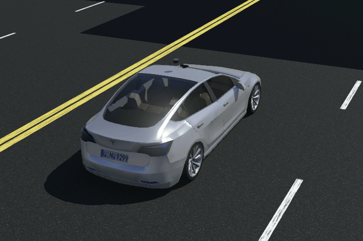

### webots 2023a

webots提供的渲染非常好，问题是直接在webots里面添加多线激光雷达后发布的点云数据pointcloud2不包含  intensity(强度值)、time(时间) 、ring(环)等属性，后续有解决方法。下面是图 ：



### 一、3D激光雷达数据

为webots获取的3D激光雷达点云数据添加点云反射强度intensity、环ring、时间time。这里有两种方法：

- webots_ros2 驱动包

如果使用官方的 webots_ros2 驱动包就只能通过订阅发布出来的 3D PointCloud2 修改 fields 字节数据修改，好处是 webots_ros2 驱动传感器方便，只需要配置yaml文件即可；不好的是webots_ros2 驱动不支持快速服务reset仿真以及传感器话题数据频率受限。如果有做强化学习相关的不推荐。

```sh
# 1-官方
ros2 launch webots_ros2_tesla robot_launch.py
# 2-修改后
ros2 launch autoware_webots autoware_car_webots_driver_launch.py
```

- 底层驱动 （推荐）

不使用webots_ros2驱动包，直接写C/C++底层驱动webots中的motor、sensor，在获取点云数据时可以直接创建fields为 “XYZIRT” ，然后将I设置为固定值，XYZR可以通过webots数据直接获取，T可以设置为仿真时间。好处是直接写底层传感器数据发布频率可以更快、数据更熟悉可控，坏处是添加传感器ros2驱动会比较麻烦，代码能力要求比较高。

```sh
# 1-启动
ros2 launch autoware_webots autoware_car_launch.py
```


### 二、vehicle 车辆配置 

- 基本运动控制

阿克曼结构的车体转弯时主要通过控制车辆的前轮转角来实现方向的改变，不会像差速底盘一样通过调节两轮之间的速度差实现转向。如果采用底层驱动仿真，需要建立车辆的基本运动控制模型，即转弯控制前轮转向，前进后退控制后轮转速。

阿克曼模型参考：https://blog.csdn.net/weixin_47012067/article/details/121097901



- 传感器配置

|  Sensor  |       Info       |
| :------: | :--------------: |
| 3D Lidar |    3D激光雷达    |
|  camera  |      摄像头      |
|   GNSS   | 全球导航卫星系统 |
|   IMU    |   惯性测量单元   |

在后面适配autoware.universe会在详细说明数据格式和内容。


